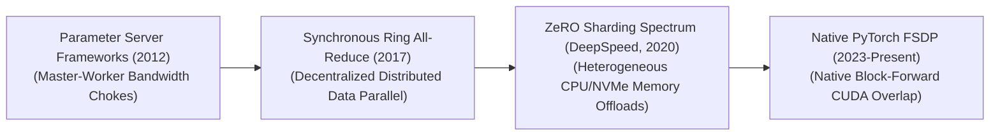
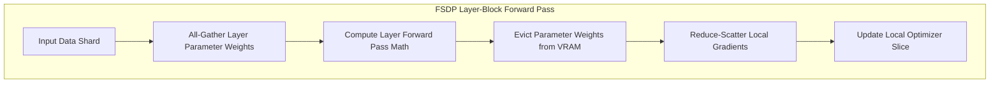

# Awesome-Fully-Sharded-Data-Parallelization
## Fully Sharded Data Parallel (FSDP): History, Progression, Variants, & Applications

**Fully Sharded Data Parallel (FSDP)** is a hardware-aware, distributed deep learning training framework designed to scale model optimization pipelines across massive multi-node GPU clusters. Formalized by Meta AI in 2023 and integrated natively into the PyTorch ecosystem, FSDP represents a milestone evolution over traditional data-parallel frameworks [INDEX: 22]. 

While classic data parallelism duplicates an entire copy of the model weights, gradients, and optimizer states across every individual GPU, FSDP breaks this memory redundancy [INDEX: 22]. By mapping out a decentralized communication grid, FSDP shards all core model state parameters evenly across the entire parallel device array, dynamically pulling and dropping layer weights via optimized collective communication primitives on-the-fly [INDEX: 22]. This framework converts standard data parallelism into an elastic, memory-saving engine, allowing infrastructures to pre-train multi-billion parameter foundation architectures cleanly without relying on brittle, complex pipeline partitioning [INDEX: 15, 22].

---

## 1. The Macro Chronological Evolution

The technical framework governing distributed data distribution has transitioned from synchronous master-worker updates to fully decentralized ringing topologies and memory-sharded parameter-offloading infrastructure networks.

*   **The Asynchronous Parameter Server Era (~2012–2016)**
    *   *Concept:* The early distributed infrastructure baseline (e.g., DistBelief). It relied on a centralized master-worker configuration: standalone worker nodes calculated independent gradients over data shards, sending them asynchronously to a central **Parameter Server** node that collected, averaged, and pushed updated weights back to the cluster.
    *   *Limitation:* Created a severe centralized network bandwidth bottleneck. As cluster sizes expanded into dozens of nodes, the parameter server became choked by incoming connection lines, stalling worker throughput.
*   **The Synchronous Distributed Data Parallel Era (DDP, ~2017–2020)**
    *   *Concept:* Overcame master-worker limitations by introducing decentralized, bandwidth-optimal communication protocols [INDEX: 22]. Popularized by Baidu and Uber’s Horovod, and formalized via PyTorch's **DistributedDataParallel (DDP)**, it arranged GPUs into a logical ring topology. Each node process communicated exclusively with its immediate left and right neighbors, executing **Ring All-Reduce** mathematical steps to sum and synchronize gradients incrementally [INDEX: 22].
    *   *Limitation:* Heavy VRAM redundancy [INDEX: 22]. Replicating 100% of the model weights, gradients, and optimizer states on *every single GPU* created a memory wall, preventing large networks from initializing on standalone cards [INDEX: 22].
*   **The Zero Redundancy Optimizer Breakthrough (ZeRO, 2020–2022)**
    *   *Concept:* Dismantled the memory duplication wall completely. Introduced by Microsoft’s DeepSpeed library, the **ZeRO (Zero Redundancy Optimizer)** framework proved that model states could be sharded across data-parallel processes without changing the underlying math [INDEX: 22]. ZeRO split the memory optimizations into three discrete stages: sharding optimizer states (Stage 1), gradients (Stage 2), and model parameters (Stage 3) [INDEX: 22].
*   **The Native PyTorch FSDP Production Standard (~2023–Present)**
    *   *Concept:* The current modern state-of-the-art infrastructure baseline. It takes the concepts of ZeRO-Stage 3 parameter sharding and bakes them straight into PyTorch's native C++ runtime layer [INDEX: 22].
    *   *Significance:* It provides **Block-Fused Forward/Backward Overlapping** out-of-the-box. FSDP wraps individual layers or transformer blocks inside nested execution enclaves. As layer $L$ computes its forward pass tensors inside GPU SRAM, FSDP preemptively fetches the sharded parameters for layer $L+1$ via background communication streams, saturating Tensor Cores perfectly with near-zero software latency.

---

## 2. Core Functional & Sharding Variants

The FSDP architecture features specialized operational profiles engineered to let developers trade network communication bandwidth for maximum GPU memory optimization.

- ### A. Full Sharding (FULL_SHARD / ZeRO-Stage 3)
	*   **Mechanism:** Enforces absolute parameter de-allocation [INDEX: 22]. It shards the model parameters, gradients, and FP32 optimizer states uniformly across all available GPUs [INDEX: 11, 22]. Layers must execute an `All-Gather` step to temporarily reconstruct weights right before a forward or backward pass and immediately evict them from memory afterward [INDEX: 22].
	*   **Pros:** Achieves maximal memory efficiency, unlocking the ability to train massive architectures containing hundreds of billions of parameters [INDEX: 15].

- ### B. Grad-and-State Sharding (SHARD_GRAD_OP / ZeRO-Stage 2)
	*   **Mechanism:** A hybrid compromise configuration [INDEX: 22]. The model parameters remain fully dense and replicated on every individual GPU during the forward pass execution [INDEX: 22]. However, the **Gradients and Optimizer States** are kept fully sharded across the cluster [INDEX: 22].
	*   **Pros:** Slashes communication latency by removing the forward-pass parameter `All-Gather` network overhead entirely, optimal for smaller models where weights fit in VRAM but optimizer moments choke capacity.

- ### C. Hybrid Sharding (HYBRID_SHARD)
	*   **Mechanism:** Tailored explicitly for massive, multi-node cluster networks. It applies classic DDP replication within a single physical server rack node (where high-speed intra-node GPU-to-GPU NVLink lanes can duplicate tensors instantly) while enforcing Full Sharding across different distinct server nodes (where slower inter-node InfiniBand or Ethernet switches dominate).
	*   **Pros:** Radically suppresses inter-node network communication traffic, preserving maximum training scale speeds.

---

## 3. The FSDP Runtime Collective Primitive Matrix

To synchronize parameters across disjointed hardware nodes seamlessly, the FSDP engine intersects the backpropagation loop using specialized collective primitives.

*   **All-Gather Primitives**
    *   *The Communication:* The inverse of slicing. It collects disjointed, sharded parameter pieces distributed across separate devices, reconstructing a unified, global weight matrix array across the localized GPU group right before a layer math step executes.
*   **Reduce-Scatter Primitives**
    *   *The Communication:* Sums and splits data. During the backward optimization pass, it sums the gradient arrays calculated over distinct data shards across all nodes, but redistributes only a localized, fractioned segment (a shard) of the total summed gradient tensor back to each individual card's optimizer slice.

---

## 4. Production Engineering Challenges & Cluster Solutions

Deploying large-scale Fully Sharded Data Parallel pipelines across massive high-performance computing clusters introduces severe communication network bottlenecks and storage constraints.

*   **The Network Interconnect and Intra-Node Communication Overhang**
    *   *The Problem:* Because FSDP requires fetching and scattering parameters continuously at every layer step, it triggers massive, continuous network traffic. If the underlying cluster network fabrics are slow (e.g., standard ethernet nodes lacking high-speed InfiniBand switches), the communication time required for `All-Gather` primitives dwarfs tensor compute time, stalling training throughput.
    *   *Mitigation:* Implementing **Backward Communication Overlapping and Pre-fetching**, forcing the FSDP scheduler to asynchronously stream parameter requests for layer $L-1$ in the background *while* layer $L$ is still calculating its backward gradient derivatives, hiding network latency completely.
*   **The Activation Memory Accumulation Wall**
    *   *The Problem:* Running massive mini-batch sizes across sharded data groups causes the volume of intermediate activation tensors cached to feed downstream backward passes to expand aggressively, saturating GPU VRAM and triggering Out-of-Memory system crashes.
    *   *Mitigation:* Integrating **Activation Checkpointing (Rematerialization)**, which discards non-boundary activation tensors immediately after forward execution, independently recalculating them on-the-fly inside fast GPU registers only when the backward loop returns.

---

## 5. Frontier Real-World AI Infrastructure Applications

*   **Pre-Training Web-Scale Foundational LLM Suites (Llama / Megatron-LM Clusters)**
    *   *Application:* Serves as the primary post-training and pre-training orchestration framework used to optimize elite base architectures (e.g., Llama 3 405B, DeepSeek variations) [INDEX: 15, 22]. FSDP memory sharding is combined alongside Tensor Parallelism and Pipeline Parallelism to form massive 3D parallel distributed layouts, processing trillions of tokens across thousands of nodes stably.
*   **High-Volume Generative Video Diffusion Simulation Scaling (Sora Class)**
    *   *Application:* Drives large-scale physical simulation training workflows. Massive spatio-temporal video token cubes are sharded across wide FSDP data-parallel groups, allowing the linear ordinary differential equation (ODE) vector fields to optimize over multi-megapixel video sequences concurrently.
*   **Distributed Low-Rank Post-Training Alignment Sprints (LoRA / QLoRA Tuning)**
    *   *Application:* Tailors foundation architectures over domain-specific enterprise datasets (such as private corporate legal or healthcare portfolios) [INDEX: 11, 16]. Distributed FSDP configurations shard low-rank adapter gradients and optimizer moments across local commodity server nodes smoothly, accelerating alignment loops cheaply [INDEX: 16].

---

## References
1. Dean, J., et al. (2012). Large scale distributed deep networks. *Advances in Neural Information Processing Systems (NeurIPS)*, 25.
2. Li, S., et al. (2020). PyTorch DDP: Accelerated distributed data parallel training. *arXiv preprint arXiv:2006.15704* [INDEX: 22].
3. Rajbhandari, S., et al. (2020). ZeRO: Memory optimizations toward training trillion parameter models. *Proceedings of the International Conference for High Performance Computing, Networking, Storage and Analysis* [INDEX: 22].
4. Meta AI Frameworks Team. (2023). Introducing PyTorch Fully Sharded Data Parallel (FSDP) API primitives. *PyTorch Engineering Architecture Manifestos* [INDEX: 22].
5. Zhao, Y., et al. (2023). PyTorch FSDP: Experiences on scaling foundational models via fully sharded data parallel architectures. *Proceedings of the VLDB Endowment*, 16(11) [INDEX: 22].
6. DeepSeek-AI. (2025). DeepSeek-V3 Technical Report: Multi-node distributed associative scans over sharded data-parallel expert topologies. *GitHub Repository Technical Infrastructure Manifesto* [INDEX: 15].

---

To advance this documentation repository, distributed infrastructure layout, or MLOps pipeline, consider exploring these adjacent development pathways:
* Build a **Python script using PyTorch Distributed (`torch.distributed.fsdp`)** illustrating how to initialize an explicit distributed process group and wrap a multi-layer Transformer block inside an automated `FullyShardedDataParallel` module [INDEX: 22].
* Generate a **comprehensive Markdown table** explicitly comparing standard Distributed Data Parallel (DDP), FSDP (Full Shard), Pipeline Parallelism (PP), and Tensor Parallelism (TP) across network communication types (P2P vs. Collective Broadcast), minimum network interconnect bandwidth limits, VRAM parameter memory efficiency, and maximum operational model capacities [INDEX: 15, 22].
* Establish an **automated performance profiling suite using PyTorch Profiler** to track the exact cluster-wide compute efficiency, communication-to-computation overlap ratios, and VRAM compression benchmarks achieved when executing an enterprise pre-fill training pass over distributed server nodes.

***

**Follow-Up Options Matrix:**

Before updating this documentation repository layout, let me know how you would like to proceed by choosing one of the options below:
* I can provide a **complete Python code boilerplate using PyTorch** demonstrating how to write an automated script that applies a custom backward-prefetch sharding policy across alternating layer blocks [INDEX: 22].
* I can generate a **Markdown matrix table** tracking the explicit network communication overheads and cluster collective primitive patterns (`All-Reduce`, `Reduce-Scatter`, `All-Gather`) utilized by leading AI supercomputing infrastructures [INDEX: 22].
* I can write a detailed technical explanation focusing on **how to configure mixed-precision policies (such as wrapping sharded parameters in FP16/BF16 computation types)** to maximize tensor core execution velocity safely [INDEX: 11, 22].

