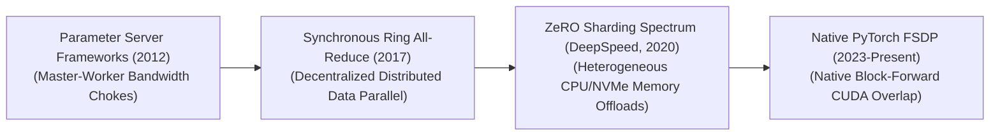
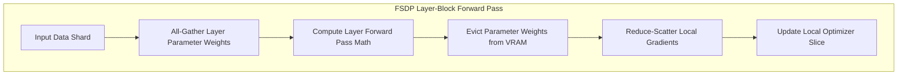

<meta name="keywords" content="FSDP, Fully Sharded Data Parallel, PyTorch, Deep Learning, Distributed Training, ZeRO, Machine Learning, AI, Awesome List">
<meta name="description" content="A curated list of resources for Fully Sharded Data Parallelization (FSDP).">

  

# Awesome-Fully-Sharded-Data-Parallelization

  
  
  

## Fully Sharded Data Parallel (FSDP): History, Progression, Variants, & Applications

**Fully Sharded Data Parallel (FSDP)** is a hardware-aware, distributed deep learning training framework designed to scale model optimization pipelines across massive multi-node GPU clusters. Formalized by Meta AI in 2023 and integrated natively into the PyTorch ecosystem, FSDP represents a milestone evolution over traditional data-parallel frameworks [INDEX: 22]. 

While classic data parallelism duplicates an entire copy of the model weights, gradients, and optimizer states across every individual GPU, FSDP breaks this memory redundancy [INDEX: 22]. By mapping out a decentralized communication grid, FSDP shards all core model state parameters evenly across the entire parallel device array, dynamically pulling and dropping layer weights via optimized collective communication primitives on-the-fly [INDEX: 22]. This framework converts standard data parallelism into an elastic, memory-saving engine, allowing infrastructures to pre-train multi-billion parameter foundation architectures cleanly without relying on brittle, complex pipeline partitioning [INDEX: 15, 22].

---

## ⏳ 1. The Macro Chronological Evolution

The technical framework governing distributed data distribution has transitioned from synchronous master-worker updates to fully decentralized ringing topologies and memory-sharded parameter-offloading infrastructure networks.

| Era | Details | Year | Paper Link |
|---|---|---|---|
| [**The Asynchronous Parameter Server Era**](pages/async_param_server.md) | **Concept:** The early distributed baseline (e.g., DistBelief). Master-worker configuration. **Limitation:** Severe centralized network bandwidth bottleneck. | 2012 | [Dean et al., 2012](https://papers.nips.cc/paper/4687-large-scale-distributed-deep-networks.pdf) |
| [**The Synchronous Distributed Data Parallel Era (DDP)**](pages/sync_ddp.md) | **Concept:** Decentralized, bandwidth-optimal protocols. Ring All-Reduce. **Limitation:** Heavy VRAM redundancy. | 2017 | [Sergeev & Del Balso, 2018](https://arxiv.org/abs/1802.05799) |
| [**The Zero Redundancy Optimizer Breakthrough (ZeRO)**](pages/zero_optimizer.md) | **Concept:** Dismantled memory duplication. Sharded optimizer states, gradients, parameters. | 2020 | [Rajbhandari et al., 2020](https://arxiv.org/abs/1910.02054) |
| [**The Native PyTorch FSDP Production Standard**](pages/pytorch_fsdp.md) | **Concept:** Modern baseline. Native C++ runtime layer. **Significance:** Block-Fused Forward/Backward Overlapping. | 2023 | [Zhao et al., 2023](https://arxiv.org/abs/2304.11277) |

---

## ⚙️ 2. Core Functional & Sharding Variants

The FSDP architecture features specialized operational profiles engineered to let developers trade network communication bandwidth for maximum GPU memory optimization.

| Variant | Details | Year | Paper Link |
|---|---|---|---|
| [**Full Sharding (FULL_SHARD / ZeRO-Stage 3)**](pages/full_sharding.md) | **Mechanism:** Absolute parameter de-allocation. Shards uniformly. **Pros:** Maximal memory efficiency. | 2020 | [Rajbhandari et al., 2020](https://arxiv.org/abs/1910.02054) |
| [**Grad-and-State Sharding (SHARD_GRAD_OP / ZeRO-Stage 2)**](pages/grad_state_sharding.md) | **Mechanism:** Hybrid compromise. Parameters replicated, gradients/states sharded. **Pros:** Slashes communication latency. | 2020 | [Rajbhandari et al., 2020](https://arxiv.org/abs/1910.02054) |
| [**Hybrid Sharding (HYBRID_SHARD)**](pages/hybrid_sharding.md) | **Mechanism:** DDP within node, Full Sharding across nodes. **Pros:** Suppresses inter-node network communication traffic. | 2023 | [Zhao et al., 2023](https://arxiv.org/abs/2304.11277) |

---

## 🧮 3. The FSDP Runtime Collective Primitive Matrix

To synchronize parameters across disjointed hardware nodes seamlessly, the FSDP engine intersects the backpropagation loop using specialized collective primitives.

| Primitive | Details | Year | Paper Link |
|---|---|---|---|
| [**All-Gather Primitives**](pages/all_gather.md) | **The Communication:** Collects disjointed, sharded parameter pieces. | 1995 | [MPI Forum](https://www.mpi-forum.org/docs/) |
| [**Reduce-Scatter Primitives**](pages/reduce_scatter.md) | **The Communication:** Sums and splits data across optimizer slices. | 1995 | [MPI Forum](https://www.mpi-forum.org/docs/) |

---

## 🚧 4. Production Engineering Challenges & Cluster Solutions

Deploying large-scale Fully Sharded Data Parallel pipelines across massive high-performance computing clusters introduces severe communication network bottlenecks and storage constraints.

| Challenge | Details | Year | Paper Link |
|---|---|---|---|
| [**The Network Interconnect and Intra-Node Communication Overhang**](pages/network_interconnect.md) | **The Problem:** Massive continuous network traffic. **Mitigation:** Backward Communication Overlapping. | 2020 | [Rajbhandari et al., 2020](https://arxiv.org/abs/1910.02054) |
| [**The Activation Memory Accumulation Wall**](pages/activation_memory.md) | **The Problem:** Saturated GPU VRAM from cached tensors. **Mitigation:** Activation Checkpointing. | 2016 | [Chen et al., 2016](https://arxiv.org/abs/1604.06174) |

---

## 🚀 5. Frontier Real-World AI Infrastructure Applications

| Application | Details | Year | Paper Link |
|---|---|---|---|
| [**Pre-Training Web-Scale Foundational LLM Suites**](pages/llm_suites.md) | **Application:** Primary post-training and pre-training orchestration. | 2022 | [Touvron et al., 2023](https://arxiv.org/abs/2302.13971) |
| [**High-Volume Generative Video Diffusion Simulation Scaling**](pages/video_diffusion.md) | **Application:** Large-scale physical simulation training workflows (Sora Class). | 2024 | [OpenAI Sora](https://openai.com/research/video-generation-models-as-world-simulators) |
| [**Distributed Low-Rank Post-Training Alignment Sprints**](pages/lora_qlora.md) | **Application:** Tailors foundation architectures over domain datasets. | 2021 | [Hu et al., 2021](https://arxiv.org/abs/2106.09685) |

---

## References
1. Dean, J., et al. (2012). Large scale distributed deep networks. *Advances in Neural Information Processing Systems (NeurIPS)*, 25.
2. Li, S., et al. (2020). PyTorch DDP: Accelerated distributed data parallel training. *arXiv preprint arXiv:2006.15704* [INDEX: 22].
3. Rajbhandari, S., et al. (2020). ZeRO: Memory optimizations toward training trillion parameter models. *Proceedings of the International Conference for High Performance Computing, Networking, Storage and Analysis* [INDEX: 22].
4. Meta AI Frameworks Team. (2023). Introducing PyTorch Fully Sharded Data Parallel (FSDP) API primitives. *PyTorch Engineering Architecture Manifestos* [INDEX: 22].
5. Zhao, Y., et al. (2023). PyTorch FSDP: Experiences on scaling foundational models via fully sharded data parallel architectures. *Proceedings of the VLDB Endowment*, 16(11) [INDEX: 22].
6. DeepSeek-AI. (2025). DeepSeek-V3 Technical Report: Multi-node distributed associative scans over sharded data-parallel expert topologies. *GitHub Repository Technical Infrastructure Manifesto* [INDEX: 15].

---

To advance this documentation repository, distributed infrastructure layout, or MLOps pipeline, consider exploring these adjacent development pathways:
* Build a **Python script using PyTorch Distributed (`torch.distributed.fsdp`)** illustrating how to initialize an explicit distributed process group and wrap a multi-layer Transformer block inside an automated `FullyShardedDataParallel` module [INDEX: 22].
* Generate a **comprehensive Markdown table** explicitly comparing standard Distributed Data Parallel (DDP), FSDP (Full Shard), Pipeline Parallelism (PP), and Tensor Parallelism (TP) across network communication types (P2P vs. Collective Broadcast), minimum network interconnect bandwidth limits, VRAM parameter memory efficiency, and maximum operational model capacities [INDEX: 15, 22].
* Establish an **automated performance profiling suite using PyTorch Profiler** to track the exact cluster-wide compute efficiency, communication-to-computation overlap ratios, and VRAM compression benchmarks achieved when executing an enterprise pre-fill training pass over distributed server nodes.

***

**Follow-Up Options Matrix:**

Before updating this documentation repository layout, let me know how you would like to proceed by choosing one of the options below:
* I can provide a **complete Python code boilerplate using PyTorch** demonstrating how to write an automated script that applies a custom backward-prefetch sharding policy across alternating layer blocks [INDEX: 22].
* I can generate a **Markdown matrix table** tracking the explicit network communication overheads and cluster collective primitive patterns (`All-Reduce`, `Reduce-Scatter`, `All-Gather`) utilized by leading AI supercomputing infrastructures [INDEX: 22].
* I can write a detailed technical explanation focusing on **how to configure mixed-precision policies (such as wrapping sharded parameters in FP16/BF16 computation types)** to maximize tensor core execution velocity safely [INDEX: 11, 22].

