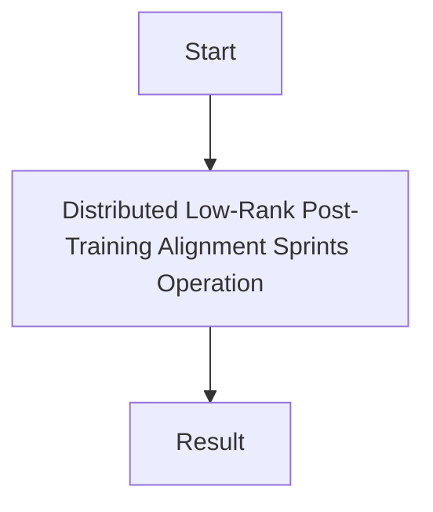

# Distributed Low-Rank Post-Training Alignment Sprints

This page contains detailed information about Distributed Low-Rank Post-Training Alignment Sprints.

## Architecture Diagram

[Back to Main README](../README.md)
