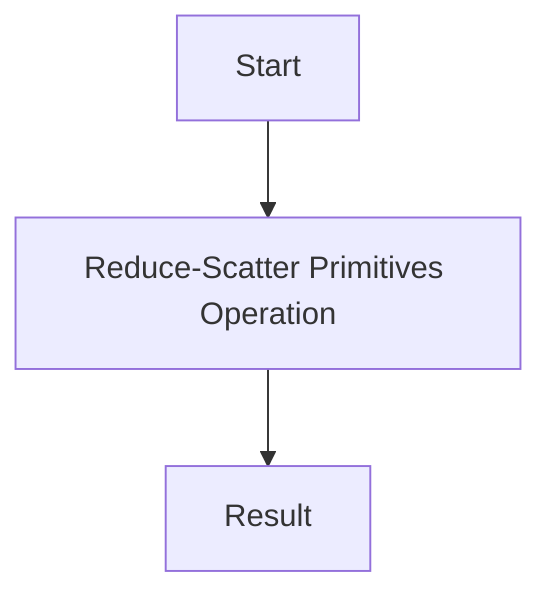

# Reduce-Scatter Primitives

This page contains detailed information about Reduce-Scatter Primitives.

## Architecture Diagram

```mermaid
flowchart TD
    A[Start] --> B[Reduce-Scatter Primitives Operation]
    B --> C[Result]
```

[Back to Main README](../README.md)
